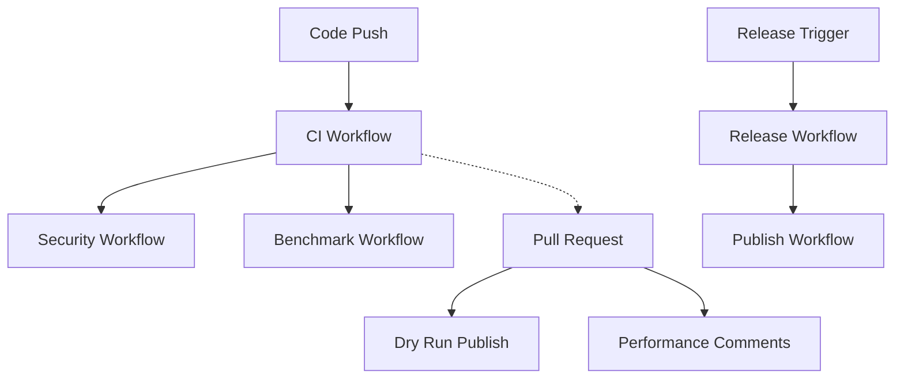

# GitHub Actions Workflows

This directory contains all the GitHub Actions workflows for the redux-unified package. These workflows provide comprehensive CI/CD automation including testing, security scanning, performance benchmarking, and publishing.

## Workflows Overview

### 🔄 CI Workflow (`ci.yml`)
**Triggers:** Push to main/develop, Pull requests  
**Purpose:** Continuous integration testing across multiple environments

**Features:**
- Tests on Node.js 18.x, 20.x, 22.x
- Cross-platform testing (Ubuntu, Windows, macOS)
- Linting with ESLint
- TypeScript compilation
- Unit and integration tests
- Code coverage with Codecov
- Build artifact validation

### 📦 Publish Workflow (`publish.yml`)
**Triggers:** Release published, Manual dispatch  
**Purpose:** Automated package publishing to NPM

**Features:**
- Security audit before publishing
- Full test suite validation
- Support for beta/alpha releases
- Dry-run for pull requests
- Package preview generation
- Uses `NPM_TOKEN` secret for authentication

### 🔒 Security Workflow (`security.yml`)
**Triggers:** Push, PR, Weekly schedule  
**Purpose:** Security scanning and dependency management

**Features:**
- CodeQL static analysis
- Dependency vulnerability scanning
- License compliance checking
- Automated dependency updates
- Snyk integration (optional)

### ⚡ Benchmark Workflow (`benchmark.yml`)
**Triggers:** Push to main, PR, Monthly schedule  
**Purpose:** Performance monitoring and regression detection

**Features:**
- Bundle size analysis
- Performance metrics tracking
- Code reduction measurements
- PR comments with results
- Historical performance data

### 🚀 Release Workflow (`release.yml`)
**Triggers:** Push to main, Manual dispatch  
**Purpose:** Automated versioning and release management

**Features:**
- Conventional commit parsing
- Automatic version bumping
- Changelog generation
- GitHub release creation
- Coordinated NPM publishing
- Support for prerelease versions

## Required Secrets

Add these secrets to your GitHub repository:

| Secret | Description | Required For |
|--------|-------------|--------------|
| `NPM_TOKEN` | NPM authentication token | Publishing workflows |
| `SNYK_TOKEN` | Snyk security scanning token | Security workflow (optional) |

## Badge URLs

Add these badges to your README:

```markdown
[](https://github.com/rvaidya/redux-unified/actions/workflows/ci.yml)
[](https://github.com/rvaidya/redux-unified/actions/workflows/security.yml)
[](https://github.com/rvaidya/redux-unified/actions/workflows/publish.yml)
```

## Manual Workflows

### Publishing a Release

1. **Automatic (Recommended):**
   - Push commits with conventional commit messages (`feat:`, `fix:`, etc.)
   - Release workflow will automatically detect and publish

2. **Manual:**
   - Go to Actions → Publish to NPM → Run workflow
   - Choose version type (patch, minor, major, prerelease)
   - For prereleases, specify tag (alpha, beta, rc)

### Running Benchmarks

- Go to Actions → Performance Benchmark → Run workflow
- Results will be uploaded as artifacts
- Performance metrics will be displayed in logs

## Workflow Dependencies



## Environment Support

All workflows are designed to work across multiple environments:

- **Node.js Versions:** 18.x, 20.x, 22.x
- **Operating Systems:** Ubuntu, Windows, macOS
- **Package Managers:** npm (primary), yarn (compatible)
- **Test Environments:** Jest with jsdom and node environments

## Troubleshooting

### Common Issues

1. **NPM Publish Fails:**
   - Check `NPM_TOKEN` secret is set
   - Verify token has publish permissions
   - Ensure version is unique

2. **Tests Fail in CI:**
   - Check cross-environment compatibility
   - Verify all dependencies are in package.json
   - Test locally with `npm ci && npm test`

3. **Security Scan Issues:**
   - Review dependency vulnerabilities
   - Update dependencies with `npm audit fix`
   - Add exceptions for false positives

4. **Performance Regression:**
   - Check bundle size increases
   - Review benchmark results
   - Optimize critical paths

### Getting Help

- Check workflow logs in the Actions tab
- Review failed steps for specific error messages
- Ensure all required secrets are configured
- Verify branch protection rules don't conflict

## Contributing

When adding new workflows:

1. Follow existing naming conventions
2. Add appropriate documentation
3. Test with minimal changes first
4. Consider cross-platform compatibility
5. Add status badges if relevant 